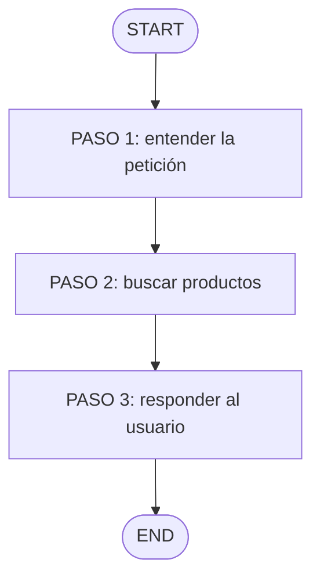

```mermaid
flowchart TD
    A([START]) --> B["PASO 1: entender la petición"]
    B --> C["PASO 2: buscar productos"]
    C --> D["PASO 3: responder al usuario"]
    D --> E([END])
```

Paso A: interpretar con LLM

Paso B: buscar con Python

Paso C: responder con plantilla